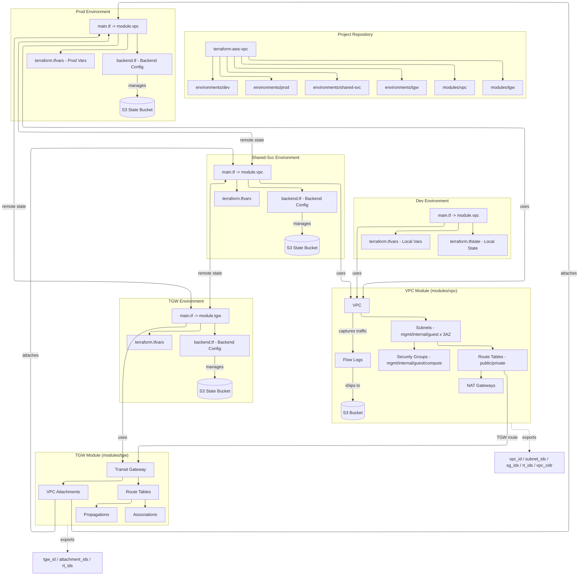
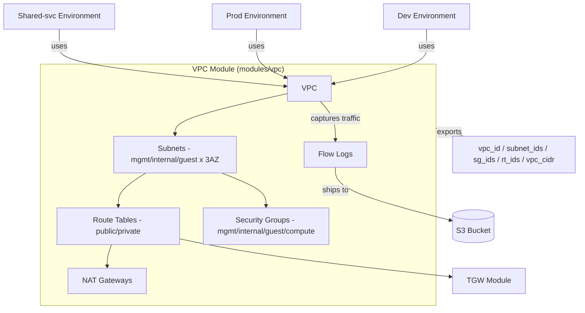
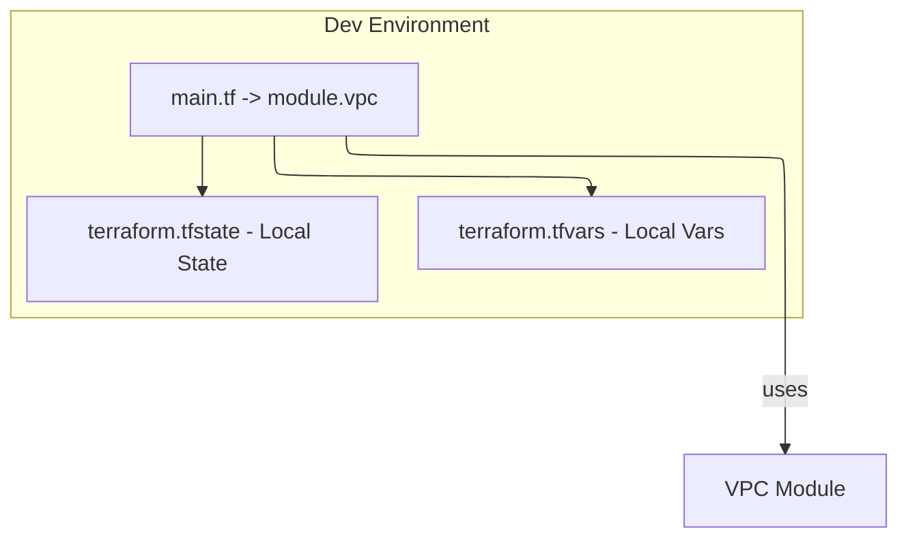
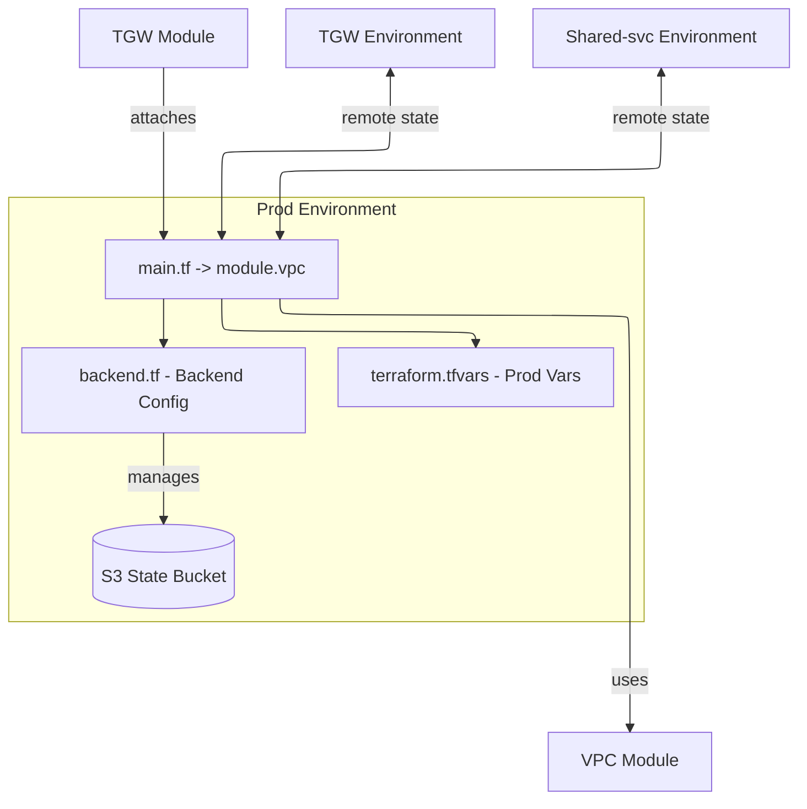

# Terraform AWS Virtual Private Cloud (VPC)

A minimal, reusable Terraform module for creating an AWS VPC architecture with:

- public and private IPv4 subnets across 3 Availability Zones (mgmt/internal/guest)
- Security Groups segmentation with ingress policies and default-deny
- Route Tables + Internet Gateway
- NAT Gateways + Elastic IPs
- Optional per-AZ NAT gateways
- S3 native state locking
- Outputs for all resources
- Flow Logs (S3)
- Remote state integration across environments via S3 backend
- Transit Gateway with per-VPC route tables, associations and propagations attachments for Cloud WAN

---

## Architecture

### **Overview**


### **VPC Module**


### **TGW Module**
```
mermaid
---
config:
  layout: elk
---
flowchart TB
 subgraph TGW_Module["TGW Module (modules/tgw)"]
    direction TB
        T1["Transit Gateway"]
        T2["VPC Attachments"]
        T3["Route Tables"]
        T4["Associations"]
        T5["Propagations"]
  end
    T1 --> T2 & T3
    T3 --> T4 & T5
    n2["TGW Environment"] --> T1
    n3["VPC Module"] --> T1
    TGW_Module L_TGW_Module_n5_0@-. exports .-> n5["tgw_id / attachment_ids / rt_ids"]
    T2 --> n1["Prod Environment"]
    T2 --> n4["Shared-svc Environment"]

    n2@{ shape: rect}
    n3@{ shape: rect}
    n5@{ shape: rect}
    n1@{ shape: rect}
    n4@{ shape: rect}

    L_TGW_Module_n5_0@{ animation: fast }
```

### **Dev Environment**


### **Prod Environment**


### **Shared-svc Environment**
```
mermaid
---
config:
  layout: elk
---
flowchart TB
 subgraph SharedSvc_Env["Shared-Svc Environment"]
    direction TB
        S1["main.tf -> module.vpc"]
        S2["terraform.tfvars"]
        S3["backend.tf - Backend Config"]
        S4[("S3 State Bucket")]
  end
    S1 --> S2 & S3
    S3 -- manages --> S4
    n1["TGW Module"] -- attaches --> S1
    n2["TGW Environment"] <-- remote state --> S1
    n4["Prod Environment"] <-- remote state --> S1
    S1 -- uses --> n3["VPC Module"]

    n1@{ shape: rect}
    n2@{ shape: rect}
    n4@{ shape: rect}
    n3@{ shape: rect}
```

### **TGW Environment**
```
mermaid
---
config:
  layout: elk
---
flowchart TB
 subgraph TGW_Env["TGW Environment"]
    direction TB
        G1["main.tf -> module.tgw"]
        G2["terraform.tfvars"]
        G3["backend.tf - Backend Config"]
        G4[("S3 State Bucket")]
  end
    G1 --> G2 & G3
    G1 -- uses --> n1["TGW Module"]
    G3 -- manages --> G4
    n2["Shared-svc Environment"] <-- remote state --> G1
    n3["Prod Environment"] <-- remote state --> G1

    n1@{ shape: rect}
    n2@{ shape: rect}
    n3@{ shape: rect}
```

---

## Environments

### `environments/dev` 
- **State:** Local (`terraform.tfstate`)
- **Purpose:** Sandbox for rapid testing of VPC module changes.
- **Run:** `cd environments/dev && terraform init && terraform apply`

### `environments/prod` 
- **State:** Remote (AWS S3 + native locking)
- **Purpose:** High-availability deployment across 3 Availability Zones.
- **Security:** Implements "Private by Default" architecture for Management and Internal tiers.

### `environments/shared-svc`
- **State:** Remote (AWS S3 + native locking)
- **Purpose:** Shared services VPC connected to prod via Transit Gateway

### `environments/tgw`
- **State:** Remote (AWS S3 + native locking)
- **Purpose:** Provisions the Transit Gateway, VPC attachments and route tables to connect prod and shared-svc

To run in production:

```bash
# Deploy prod VPC
cd environments/prod && terraform apply

# Deploy shared-svc VPC
cd environments/shared-svc && terraform apply

# Deploy Transit Gateway
cd environments/tgw && terraform apply

# Apply TGW routes back to VPCs
cd environments/prod && terraform apply
cd environments/shared-svc && terraform apply
```

NAT Gateway & Flow Logs are disabled by default in prod & shared-svc environments to avoid AWS charges. Override `enable_nat_gateway = true` & `enable_flow_logs = true` in thier `main.tf` or modify their `variables.tf`.

---

## Usage

```hcl
module "vpc" {
  source = "git::https://github.com/m3lcy/terraform-aws-vpc.git//modules/vpc?ref=main" 

  name_prefix = "tf_example"
  environment = "dev"
  vpc_cidr    = "10.0.0.0/16"
  management_ssh_cidrs = [] 
  enable_nat_gateway = false
  enable_flow_logs   = false      
  flow_log_traffic_type = "ALL"


  subnet_config = {
    # Management tier (private) - bastion, monitoring, admin tools
    mgmt-1a = { cidr_block = "10.0.0.0/24", az = "us-east-1a", is_public = false }
    mgmt-1b = { cidr_block = "10.0.1.0/24", az = "us-east-1b", is_public = false }
    mgmt-1c = { cidr_block = "10.0.2.0/24", az = "us-east-1c", is_public = false }

    # Internal tier (private) - application servers, databases, backend services
    internal-1a = { cidr_block = "10.0.3.0/24", az = "us-east-1a", is_public = false }
    internal-1b = { cidr_block = "10.0.4.0/24", az = "us-east-1b", is_public = false }
    internal-1c = { cidr_block = "10.0.5.0/24", az = "us-east-1c", is_public = false }

    # Guest / Public tier - load balancers, public services
    guest-1a = { cidr_block = "10.0.6.0/24", az = "us-east-1a", is_public = true }
    guest-1b = { cidr_block = "10.0.7.0/24", az = "us-east-1b", is_public = true }
    guest-1c = { cidr_block = "10.0.8.0/24", az = "us-east-1c", is_public = true }
  }

  tags = {
    Environment = "dev"
    ManagedBy   = "terraform"
    Project     = "terraform-aws-vpc_development"
  }
}
```

---

## Key Outputs

This module exposes useful outputs for downstream modules:

### VPC Module
- `vpc_id`
- `subnet_ids`, `public_subnet_ids`, `private_subnet_ids`
- `subnet_ids_by_key` (e.g., `mgmt`, `internal`, `guest`)
- `public_route_table_id`
- `private_route_table_ids` (one per private subnet)
- `security_group_ids` (mgmt/compute/internal/guest)
- `nat_gateway_ids`, `nat_eip_ids` (one per AZ, when enabled)
- `flow_log_bucket_arn`, `flow_log_id`
- `mgmt_subnet_ids` (for TGW attachment)

### TGW Module
- `transit_gateway_id`, `transit_gateway_arn`
- `attachment_ids` (keyed by attachment name)
- `route_table_ids` (keyed by route table name)