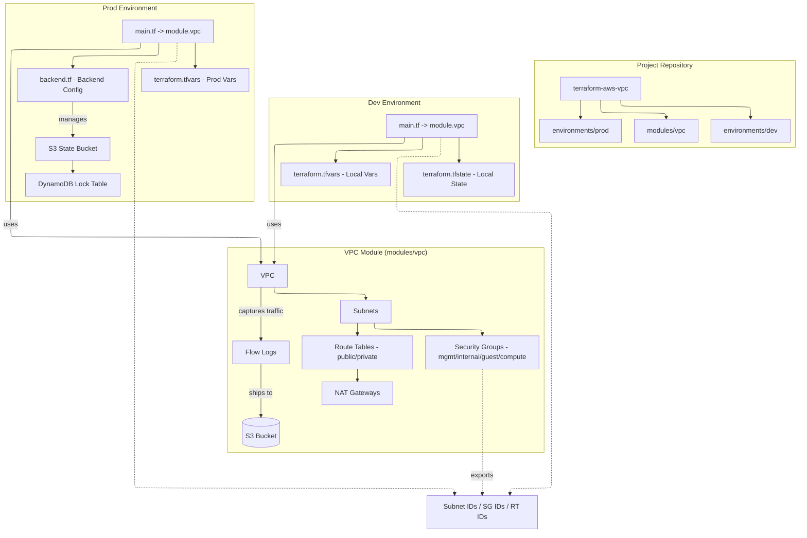
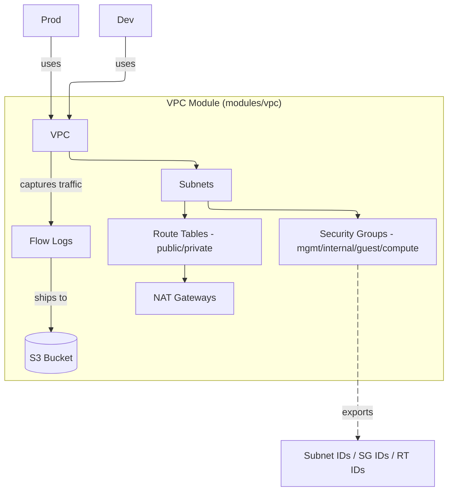
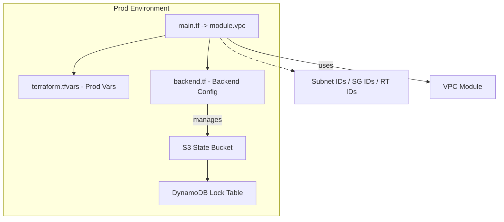
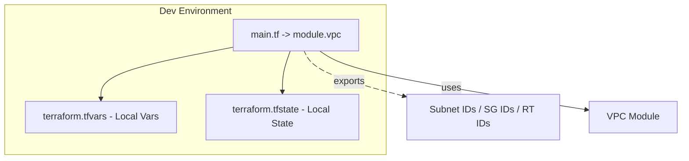

# Terraform AWS Virtual Private Cloud (VPC)

A minimal, reusable Terraform module for creating an AWS VPC architecture with:

- public and private IPv4 subnets (segmenting mgmt/internal/guest)
- security groups for management, compute, internal, and guest
- route tables + gateways (IGW)
- Elastic IPs
- optional per-AZ NAT gateways
- outputs for all resources
- Flow logs (S3)

Coming soon:

- Flow logs (CloudWatch/S3)

---

## Architecture

### **Overview**


### **VPC Module**


### **Prod Environment**


### **Dev Environment**


---

## Environments

### `environments/dev` 
- **State:** Local (`terraform.tfstate`)
- **Purpose:** Sandbox for rapid testing of VPC module changes.
- **Run:** `cd environments/dev && terraform init && terraform apply`

### `environments/prod` 
- **State:** Remote (AWS S3 + DynamoDB locking)
- **Purpose:** High-availability deployment across 3 Availability Zones.
- **Security:** Implements "Private by Default" architecture for Management and Internal tiers.

To run in prod:

```bash
cd environments/prod
terraform init
terraform plan
# terraform apply
```

NAT Gateway is disabled by default to avoid AWS charges, set `enable_nat_gateway = true` in `main.tf`

---

## Usage

```hcl
module "vpc" {
  source = "git::https://github.com/m3lcy/terraform-aws-vpc.git//modules/vpc?ref=main" 

  name_prefix = "tf_example"
  environment = "dev"
  vpc_cidr    = "10.0.0.0/16"

  enable_nat_gateway = true          

  management_ssh_cidrs = []   


  subnet_config = {
    # Management tier (private) - bastion, monitoring, admin tools
    mgmt-1a = { cidr_block = "10.0.0.0/24", az = "us-east-1a", is_public = false }
    mgmt-1b = { cidr_block = "10.0.1.0/24", az = "us-east-1b", is_public = false }
    mgmt-1c = { cidr_block = "10.0.2.0/24", az = "us-east-1c", is_public = false }

    # Internal tier (private) - application servers, databases, backend services
    internal-1a = { cidr_block = "10.0.3.0/24", az = "us-east-1a", is_public = false }
    internal-1b = { cidr_block = "10.0.4.0/24", az = "us-east-1b", is_public = false }
    internal-1c = { cidr_block = "10.0.5.0/24", az = "us-east-1c", is_public = false }

    # Guest / Public tier - load balancers, public services
    guest-1a = { cidr_block = "10.0.6.0/24", az = "us-east-1a", is_public = true }
    guest-1b = { cidr_block = "10.0.7.0/24", az = "us-east-1b", is_public = true }
    guest-1c = { cidr_block = "10.0.8.0/24", az = "us-east-1c", is_public = true }
  }

  tags = {
    Environment = "dev"
    ManagedBy   = "terraform"
    Project     = "terraform-aws-vpc_development"
  }
}
```

---

## Key Outputs

This module exposes useful outputs for downstream modules:

- `vpc_id`
- `subnet_ids`, `public_subnet_ids`, `private_subnet_ids`
- `subnet_ids_by_key` (e.g., `mgmt`, `internal`, `guest`)
- `public_route_table_id`
- `private_route_table_ids` (one per private subnet)
- `security_group_ids` (mgmt/compute/internal/guest)
- `nat_gateway_ids` / `nat_eip_ids` (one per AZ, when enabled)
- `flow_log_bucket_arn`, `flow_log_id`